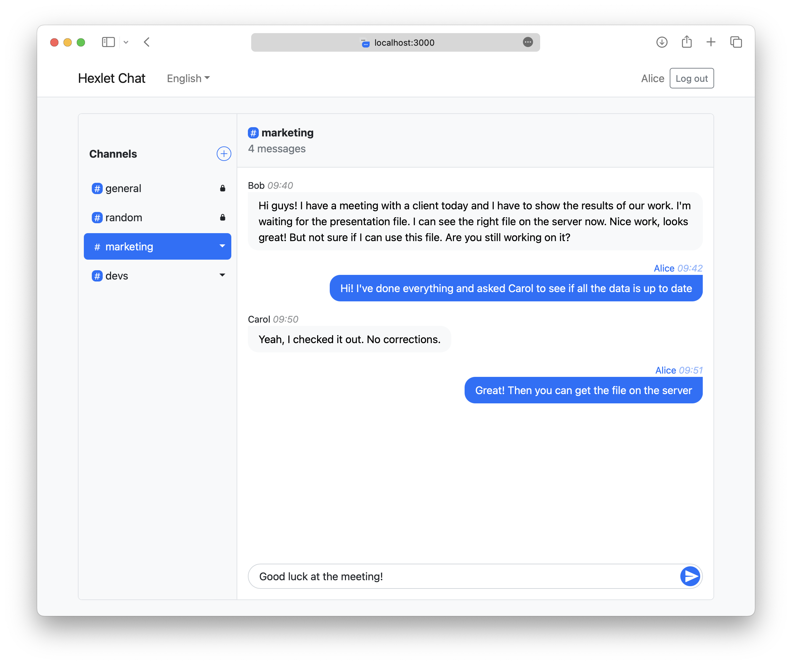

[](https://github.com/faciledictu/frontend-project-12/actions)

# Hexlet Chat

Hexlet Chat is a group chat app with the ability to create an unlimited number of channels. Works in web browser.

This is my studying project at Hexlet School.

[](http://faciledictu-frontend-project-12.up.railway.app)

Demo: [faciledictu-frontend-project-12.up.railway.app](http://faciledictu-frontend-project-12.up.railway.app)

## Installation

```bash
make ci
```

## Running the app locally

```bash
make start
```

The app will be available on _localhost:3000_

## Deploy

Build the app

```bash
npm run build
```

Run builded app

```bash
npm start
```

## Built with

[![React][React-badge]][React-url]
[![Redux][Redux-badge]][Redux-url]
[![Bootstrap][Bootstrap-badge]][Bootstrap-url]
[![Axios][Axios-badge]][Axios-url]
[![i18next][i18next-badge]][i18next-url]
[![Formik][Formik-badge]][Formik-url]

[React-badge]: https://img.shields.io/badge/React-087ea4?style=flat&logo=react&logoColor=white
[React-url]: https://react.dev

[Redux-badge]: https://img.shields.io/badge/Redux-764abc?style=flat&logo=redux
[Redux-url]: https://redux.js.org

[Bootstrap-badge]: https://img.shields.io/badge/Bootstrap-712CF9?style=flat&logo=bootstrap&logoColor=white
[Bootstrap-url]: https://getbootstrap.com

[i18next-badge]: https://img.shields.io/badge/i18next-26A69A?style=flat&logo=i18next&logoColor=white
[i18next-url]: https://www.i18next.com

[Axios-badge]: https://img.shields.io/badge/Axios-5A29E4?style=flat&logo=axios&logoColor=white
[Axios-url]: https://axios-http.com

[Formik-badge]: https://img.shields.io/badge/Formik-357af3?style=flat&logo=formik
[Formik-url]: https://formik.org
